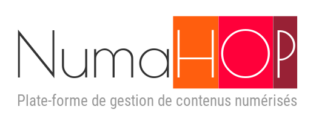

# NumaHOP 

> This repository is not the official repository for NumaHOP. This is the repository used by BibLibre for their developpements.

This project is licenced under AGPLv3, see [LICENSE.md](LICENSE) for details.

The developper documentation is available [here](https://biblibre.github.io/NumaHOP-doc/).

The offical website (in french) is at this [link](https://www.numahop.fr/).

## What is NumaHOP ?

[NumaHOP](https://www.numahop.fr/) is a software solution to manage the digitalization process of documents from the import of meta-datas and condition report to the diffusion of the documents. It serves as an intermediary between the digitalization provider, the establishments and the export targets. This is mostly an automated process with occasional manual operations and verifications.

## What NumaHOP can do

NumaHOP is composed of modules that can:
- import and convert bibliographic records into DublinCore.
- inspect and validate images and bibliographic records of digitalized documents.
- make condition reports for bundles sent to the digitalization provider.
- use workflow for managing digitalization projects.
- export documents to archiving services or digital libraries.
- produce derived documents like OCR, METS, scaled down images.

NumaHOP is able to automatically diffuse documents in bulk. The platform supported are:
- An SFTP server
- OMEKA/OMEKAS
- CINES
- Internet Archive

NumaHOP is also able to be shared between establishments and allows to make conjoint projects.

## Installation and dependencies

NumaHOP is a fullstack Java Spring boot and angular-js application built with maven and gruntjs.
It uses Mariadb and elasticsearch8.

Dependency list:
- OpenJdk17
- Mariadb 
- ElasticSearch 8.*
- Tesseract
- ImageMagick
- Exiftool
- libyaz4 (optional)

Build dependency list:
- maven (optional)
- gnumake (optional)

The installation manual can be found at this url: https://biblibre.github.io/NumaHOP-doc/install/index.html

## Project Actors

### Original Specification Redactors
- Sainte-Geneviève Library
- Science-Po Library
- BULAC

### Project contributors
- **TECH'advantage** - https://www.tech-advantage.com/
- **Persée** : https://www.persee.fr/
- **BibLibre** : https://www.biblibre.com/
